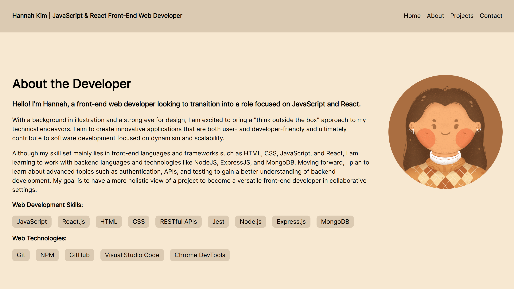

# Personal Portfolio

https://portfolio-1dd.pages.dev/

## Project Summary

This project is a personal portfolio to showcase my skill sets as a JavaScript and React front-end web developer. Inspired by my personal art style, this website features a warm color palette, round shapes, and a minimalistic design.

## Sections

### About the Developer

A brief introduction about the developer, highlighting key web development skills and technologies.

### Featured Projects

The developer's top 3 projects with a general overview of each project, significant achievements, and technical concepts that were applied.

### Contact

Links provided to the developer's GitHub and Email for future inquiries.

### 404

A dead end, but gives users the option to redirect to the home page.

## Credits

- GitHub icon by [GitHub](https://github.com/)
- Miscellaneous icons by [Google Fonts](https://fonts.google.com/)
- Favicon icon by Hannah Kim
- Author image by Hannah Kim
- 404 "dead end" image by Hannah Kim

\*\***Please do not trace, copy, reproduce, or redistribute images created by myself without permission.**\*\*
